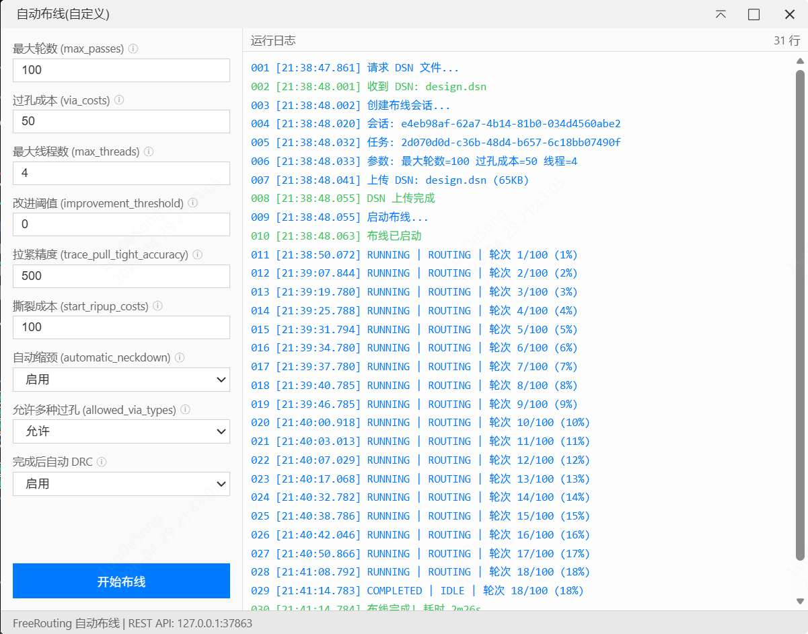

# FreeRouting 自动布线器集成

[English](README_EN.md)

通过本扩展你可以直接把PCB文件推送给开源自动布线工具Freerouting，并且不需要手动运行Freerouting，并操作导入导出自动布线文件，实现一键自动布线，为PCB自动布线提供新的选择。

## 功能特性

- **快速自动布线** - 一键启动，使用优化的默认参数快速完成 PCB 布线，布线过程中通过进度条实时显示进度
- **自定义布线** - 通过可视化面板配置布线参数（最大轮数、过孔成本、线程数等），满足不同设计需求
- **实时预览** - 布线过程中每隔数秒自动获取中间结果并更新到画布，实时查看布线效果
- **停止布线** - 支持随时停止布线，保留当前已有的布线结果
- **自动 DRC** - 布线完成后可自动执行设计规则检查
- **层名转换** - 自动将 FreeRouting 层名转换为嘉立创EDA格式
- **自动启动** - 自动检测 FreeRouting 服务，未运行时通过 URL Scheme 自动唤起

## 注意事项

- **运行环境** - 本扩展仅支持嘉立创EDA专业版 V3.2 及以上版本。
- **不支持保留已有布线** - 每次执行自动布线时，会清除 PCB 上现有的所有导线和过孔（未锁定的），然后导入 FreeRouting 的布线结果。如需保留部分手动布线，请先锁定对应的导线和过孔。

## 使用方法

### 安装方式

1. 打开嘉立创EDA专业版，在顶部菜单：高级 - 扩展管理器，找到Freerouting，点击安装
2. 或者下载扩展包eext文件，在顶部菜单：高级 - 扩展管理器 - 导入 eext 文件导入
3. 安装后点击到已安装列表，点击Freerouting，在配置处开启允许"**外部交互**"（必须开启，否则无法连接 FreeRouting 服务）

4. 下载并安装Freerouting最新版本，需V2.2.0及以上。[下载Freerouting](https://github.com/freerouting/freerouting/releases)

### 快速布线

1. 在嘉立创EDA专业版中打开 PCB 文档
2. 点击菜单 **FreeRouting → 直接自动布线**
3. 扩展会自动检测 FreeRouting 服务是否运行，如未运行会自动唤起 FreeRouting（首次可能需要允许浏览器打开 FreeRouting）
4. 等待布线完成，结果自动导入。布线过程中会显示进度条，可通过 **FreeRouting → 停止布线** 随时停止

### 自定义布线

1. 点击菜单 **FreeRouting → 自定义自动布线...**
2. 在弹出的面板中，左侧配置布线参数，右侧查看运行日志

3. 可配置的参数包括：最大轮数、过孔成本、最大线程数、改进阈值、拉紧精度、撕裂成本、自动缩颈、允许多种过孔、完成后自动 DRC
4. 点击 **开始布线** 开始，布线过程中按钮变为 **停止布线**，点击可随时停止
5. 布线过程中每隔数秒自动获取中间结果并更新到画布

### 布线参数说明

| 参数 | 默认值 | 说明 |
|------|--------|------|
| 最大轮数 (max_passes) | 100 (自定义) / 50 (快速) | 布线迭代次数 |
| 过孔成本 (via_costs) | 50 | 过孔的成本权重，越高越少使用过孔 |
| 最大线程数 (max_threads) | 4 | 并行布线的线程数 |
| 改进阈值 (improvement_threshold) | 0 | 控制停止条件，0 表示完全布线 |
| 拉紧精度 (trace_pull_tight_accuracy) | 500 | 走线拉紧的精度 |
| 撕裂成本 (start_ripup_costs) | 100 | 撕裂已有走线的起始成本 |
| 自动缩颈 (automatic_neckdown) | 启用 | 自动在狭窄区域缩小走线宽度 |
| 允许多种过孔 (allowed_via_types) | 允许 | 允许使用不同类型的过孔 |
| 完成后自动 DRC | 启用 | 布线完成后自动执行设计规则检查 |

## 鸣谢

1. 感谢 [Freerouting项目](https://github.com/freerouting/freerouting/releases)，感谢[andrasfuchs](https://github.com/andrasfuchs)等作者提供的Freerouting工具及API能力
2. 感谢 Freerouting贡献者 [L1uTongweiNewAccount](https://github.com/L1uTongweiNewAccount) 帮助Freerouting API的适配
