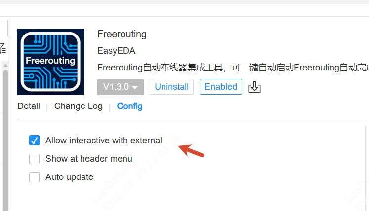

# FreeRouting Auto-Router Integration

[中文](README.md)

With this extension, you can directly push PCB files to the open-source auto-routing tool FreeRouting without manually running FreeRouting or handling import/export of routing files, enabling one-click auto-routing and providing a new option for PCB automatic routing.

## Features

- **Quick Auto-Routing** - One-click startup with optimized default parameters for fast PCB routing, with real-time progress bar during routing
- **Custom Routing** - Configure routing parameters (max passes, via cost, threads, etc.) through a visual panel to meet different design requirements
- **Real-time Preview** - Automatically fetches intermediate results every few seconds during routing and updates the canvas for live preview
- **Stop Routing** - Stop routing at any time and keep the current routing results
- **Auto DRC** - Optionally run design rule check automatically after routing completes
- **Layer Name Conversion** - Automatically converts FreeRouting layer names to EasyEDA format

## Important Notes

- **System Requirements** - This extension requires EasyEDA Pro V3.2 or above.
- **Existing routes are not preserved** - Each time auto-routing is executed, all existing traces and vias (unlocked) on the PCB will be cleared before importing FreeRouting results. To preserve manual routing, lock the corresponding traces and vias first.

## Usage

### Installation

1. Open EasyEDA Pro, go to top menu: Advanced - Extension Manager, find FreeRouting, and click Install
2. Or download the .eext extension package, go to top menu: Advanced - Extension Manager - Import .eext file
3. After installation, go to Installed list, click FreeRouting, and enable "**External Interaction**" in settings (required for connecting to FreeRouting service)

4. Download and install the latest FreeRouting version (V2.2.0 or above). [Download FreeRouting](https://github.com/freerouting/freerouting/releases)

### Install Java 25 Runtime

The bundled JRE in FreeRouting 2.2.0 is missing modules required by the API server. A full Java 25 JRE is needed.

**Auto Install:**

Run `install-java.bat`, it will automatically download and install Temurin JRE 25 to `%LOCALAPPDATA%\freerouting\jre-25\`.

**Manual Install:**

1. Download [Temurin JRE 25](https://adoptium.net/temurin/releases/?version=25) (choose Windows x64 JRE zip)
2. Extract to `%LOCALAPPDATA%\freerouting\jre-25\` (i.e. `C:\Users\<username>\AppData\Local\freerouting\jre-25\`)
3. Verify that `%LOCALAPPDATA%\freerouting\jre-25\bin\java.exe` exists

### Start FreeRouting Service

[Node.js](https://nodejs.org/) is required (for the CORS proxy).

Run `start-freerouting.bat`, it will automatically start:
1. FreeRouting API server (port 37864, headless mode)
2. CORS proxy (port 37863, auto-injects auth headers)

Close the window to stop all services.

### Quick Routing

1. Start the service by running `start-freerouting.bat` first
2. Open a PCB document in EasyEDA Pro
3. Click menu **FreeRouting → Auto Route**
4. Wait for routing completion, results will be imported automatically. A progress bar is shown during routing, and you can stop at any time via **FreeRouting → Stop Routing**

### Custom Routing

1. Click menu **FreeRouting → Auto Route(Custom)...**
2. In the popup panel, configure routing parameters on the left and view logs on the right

3. Configurable parameters include: max passes, via cost, max threads, improvement threshold, trace pull tight accuracy, start ripup costs, automatic neckdown, allowed via types, auto DRC after completion
4. Click **Start Routing** to begin. During routing the button changes to **Stop Routing**, click to stop at any time
5. Intermediate results are automatically fetched and updated on the canvas every few seconds during routing

### Routing Parameters

| Parameter | Default | Description |
|-----------|---------|-------------|
| Max Passes (max_passes) | 100 (custom) / 50 (quick) | Routing iteration count |
| Via Cost (via_costs) | 50 | Cost weight for vias, higher values result in fewer vias |
| Max Threads (max_threads) | 4 | Number of threads for parallel routing |
| Improvement Threshold (improvement_threshold) | 0 | Controls stop condition, 0 means complete routing |
| Trace Pull Tight Accuracy (trace_pull_tight_accuracy) | 500 | Accuracy for trace pull-tight optimization |
| Start Ripup Costs (start_ripup_costs) | 100 | Starting cost for ripping up existing traces |
| Automatic Neckdown (automatic_neckdown) | Enabled | Automatically reduce trace width in narrow areas |
| Allowed Via Types (allowed_via_types) | Allowed | Allow using different types of vias |
| Auto DRC | Enabled | Run DRC automatically after routing completes |

## Acknowledgments

1. Thanks to the [FreeRouting Project](https://github.com/freerouting/freerouting/releases) and authors like [andrasfuchs](https://github.com/andrasfuchs) for providing the FreeRouting tool and API capabilities
2. Thanks to FreeRouting contributor [L1uTongweiNewAccount](https://github.com/L1uTongweiNewAccount) for helping adapt the FreeRouting API
